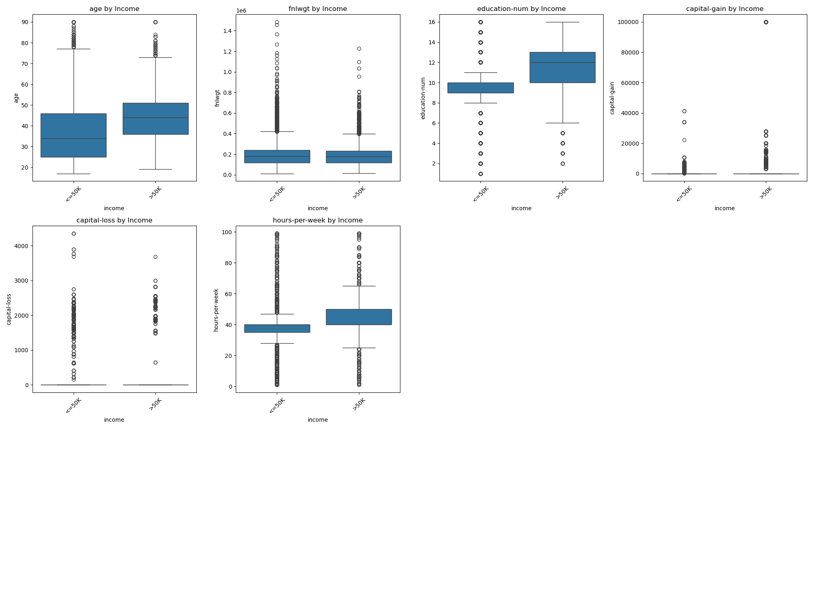

# CS_273A_project
# Machine Learning Model Exploration and Optimization Report

## Introduction
This report explores several advanced machine learning techniques, focusing on parameter tuning, complexity control, and feature engineering. Models evaluated include Random Forest, XGBoost, LightGBM, and Neural Networks. The dataset, analysis steps, model performance, and insights are presented.

---

## Dataset Analysis

### Overview
- **Training Set Size:** 32,561 samples
- **Test Set Size:** 16,281 samples
- **Features:** 15 (numerical and categorical)
- **Target Variable:** Binary classification (`<=50K`, `>50K` income levels)

### Key Challenges
1. **Missing Values:**
   - Significant in `workclass` (5.64%), `occupation` (5.66%), and `native-country` (1.79%) for the training set.
   - Missing values in the test set include `workclass` (5.91%), `occupation` (5.93%), and `native-country` (1.68%).
2. **Class Imbalance:**
   - Training set: `<=50K` (76%), `>50K` (24%).
   - Test set: `<=50K` (76.4%), `>50K` (23.6%).
3. **Skewed Features:**
   - `capital-gain` and `capital-loss` contain a majority of zeros in both training and test sets.

### Statistical Insights
- **Boxplot Analysis:**
  Below is the distribution of key numerical features visualized to identify outliers and differences across classes:

  

- **Correlation Heatmap:**
  Correlation between numerical features is visualized below. Features like `education-num` and `capital-gain` show some correlation with the target variable:

  

---

## Feature Engineering

### Custom Features
1. **Financial Features:**
   - `capital_total = capital-gain - capital-loss`
   - `has_capital` (binary: 1 if `capital_total > 0`, else 0)
   - `capital_per_hour = capital_total / hours-per-week`
2. **Work-Intensity Metric:** Derived from `hours-per-week` and `workclass`.
3. **Education Level Mapping:** Categorical values mapped to numerical levels for better interpretation.

### Preprocessing Steps
- **Imputation:** Missing values in `workclass`, `occupation`, and `native-country` filled using the mode.
- **Normalization:** Min-max scaling applied to numerical features.
- **Class Balancing:** Oversampling using SMOTE (Synthetic Minority Oversampling Technique).

### Feature Engineering Insights
The impact of engineered features on class separation is shown below:

---

## Models and Hyperparameters

### Models Explored
1. **Random Forest**
2. **XGBoost**
3. **LightGBM**
4. **Neural Network**

### Hyperparameter Tuning
1. **Random Forest:**
   - `n_estimators`: 100
   - `max_depth`: [10, 20]
   - `class_weight`: balanced
2. **XGBoost:**
   - `learning_rate`: 0.1
   - `max_depth`: [3, 6]
   - `n_estimators`: 100
3. **LightGBM:**
   - `learning_rate`: 0.1
   - `max_depth`: [3, 6]
   - `n_estimators`: 100
   - `min_child_samples`: 50
   - `colsample_bytree`: 0.8
4. **Neural Network:**
   - Architecture: [128, 64, 32] hidden layers
   - `batch_size`: 64
   - `epochs`: 100
   - `learning_rate`: 0.0001

---

## Model Evaluation

### Feature Importance
Feature importance derived from Random Forest, XGBoost, and LightGBM is visualized below:

1. **Random Forest Feature Importance:**
   
   

2. **XGBoost Feature Importance:**
   
   

3. **LightGBM Feature Importance:**
   
   

### Performance Metrics
- **Cross-Validation Results:**
  | Model            | CV Mean Score | CV Std  |
  |-------------------|---------------|---------|
  | Random Forest     | 89.70%        | 2.56%   |
  | XGBoost           | 88.42%        | 2.61%   |
  | LightGBM          | **88.79%**    | **3.18%** |
  | Neural Network    | 73.25%        | 6.33%   |

- **Test Set Results:**
  | Model            | Test Accuracy | Precision (class 1) | Recall (class 1) | F1-Score (class 1) |
  |-------------------|---------------|----------------------|------------------|---------------------|
  | Random Forest     | 83.64%        | 62.75%              | 75.69%          | 68.62%             |
  | XGBoost           | 84.36%        | 63.15%              | **81.10%**      | **71.01%**         |
  | LightGBM          | **84.61%**    | **64.05%**          | 79.38%          | 70.90%             |
  | Neural Network    | 80.38%        | 55.45%              | 86.25%          | 67.50%             |

---

## Observations and Insights

### Strengths and Weaknesses
1. **LightGBM:**
   - Best overall performance due to its ability to handle categorical features efficiently.
   - Effective with fewer hyperparameters compared to XGBoost.
2. **Neural Network:**
   - Underperformed due to insufficient epochs for convergence and sensitivity to imbalanced data.
3. **Random Forest:**
   - Stable performance but less precise for minority class predictions.

### Key Learnings
- Feature engineering significantly improved the performance of tree-based models.
- Oversampling reduced class imbalance, enhancing recall for the minority class.
- Grid search provided valuable insights into optimal hyperparameter ranges.

---

## Conclusion
This study highlights the importance of feature engineering and hyperparameter optimization. LightGBM emerged as the best-performing model, achieving a test accuracy of 84.61%. Future work can focus on improving neural network architectures and exploring ensemble methods to combine model strengths.

